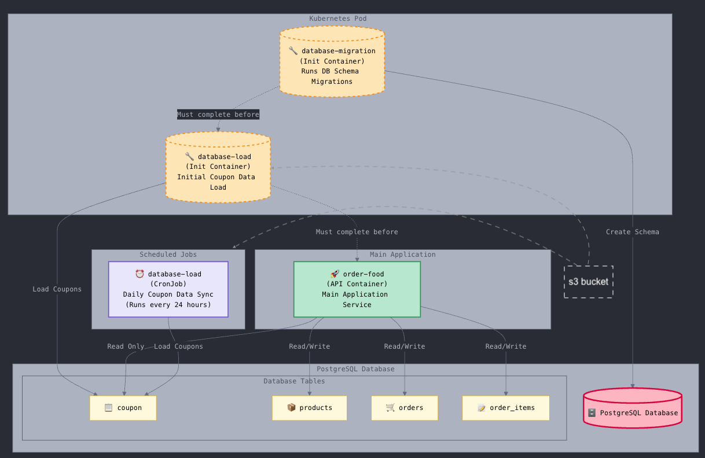

# Food Ordering Microservices Platform

A cloud-native food ordering platform built with Go, featuring REST Level 3 HATEOAS APIs, microservices architecture, PostgreSQL persistence, and Kubernetes orchestration.



## Features

### REST Level 3 HATEOAS APIs
- **Hypermedia-Driven**: All API responses include HATEOAS links for resource discovery
- **Self-Descriptive**: Clients can navigate the API without hardcoded URLs
- **Pagination Support**: Efficient data retrieval with customizable page sizes
- **Standard HTTP Methods**: Full support for GET, POST, PUT, DELETE operations

### Promo Code Validation System
- **Smart Validation**: Validates promo codes against multiple data sources
- **Distributed Storage**: Promo codes stored across multiple files with deduplication
- **Business Rules Engine**:
  - Codes must be 8-10 characters long
  - Must exist in at least 2 different source files
  - Real-time validation during order creation

### Microservices Architecture
- **order-food**: Main API service handling products and orders
- **database-migration**: Schema management with golang-migrate
- **database-load**: Automated data loader running as Kubernetes CronJob
- **PostgreSQL**: Persistent data storage with connection pooling

### Data Management
- **Concurrent Processing**: Parallel file loading using goroutines
- **Idempotent Operations**: Safe to run multiple times without duplication
- **Composite Keys**: Natural deduplication at database level
- **JSON Storage**: Flexible schema for complex order data

### Cloud-Native Features
- **Kubernetes Ready**: Helm charts for easy deployment
- **Init Containers**: Automated database migrations on startup
- **CronJob Integration**: Scheduled data loading every minute
- **Health Checks**: Readiness and liveness probes
- **Graceful Shutdown**: Proper signal handling

## Architecture Advantages

### 1. Separation of Concerns
- **API Layer**: Clean handlers with single responsibility
- **Service Layer**: Business logic isolated from infrastructure
- **Repository Layer**: Database operations abstracted
- **Utility Layer**: Reusable pagination and validation logic

### 2. Scalability
- **Horizontal Scaling**: Stateless services can scale independently
- **Database Connection Pooling**: Efficient resource utilization
- **Pagination**: Prevents memory overload with large datasets
- **Concurrent Processing**: Parallel file loading for performance

### 3. Maintainability
- **Clear Module Structure**: Easy to navigate and understand
- **Dependency Injection**: Loose coupling between components
- **Comprehensive Documentation**: Code comments and API docs
- **Error Handling**: Consistent error responses across all endpoints

### 4. Reliability
- **Database Retry Logic**: Automatic reconnection on failure
- **Transaction Safety**: ACID compliance for data integrity
- **Idempotent Operations**: Safe retries for all operations
- **Health Monitoring**: Built-in health check endpoints

### 5. Developer Experience
- **Single Command Deployment**: Automated build and deploy script
- **Docker Multi-Stage Builds**: Small, secure container images
- **Hot Reload**: Fast iteration during development
- **Clear Logging**: Structured logs for debugging

## Technology Stack

- **Language**: Go 1.25
- **Web Framework**: Gin (high-performance HTTP router)
- **Database**: PostgreSQL 15 with JSONB support
- **Migration Tool**: golang-migrate
- **Container Runtime**: Docker
- **Orchestration**: Kubernetes (Minikube for local)
- **Package Manager**: Helm 3
- **Database Driver**: lib/pq

## Project Structure

```
kart-challenge-workspace/
├── order-food/                  # Main API service
│   ├── cmd/main.go              # Application entry point
│   ├── internal/
│   │   ├── handler/             # HTTP handlers
│   │   │   ├── product_handler.go
│   │   │   ├── order_handler.go
│   │   │   └── health_handler.go
│   │   ├── service/             # Business logic
│   │   │   ├── product_service.go
│   │   │   ├── order_service.go
│   │   │   └── promo_code_service.go
│   │   ├── repository/          # Data access layer
│   │   │   ├── product_repository.go
│   │   │   └── order_repository.go
│   │   ├── models/              # Data models
│   │   │   ├── product.go
│   │   │   ├── order.go
│   │   │   └── hateoas.go
│   │   ├── middleware/          # HTTP middleware
│   │   │   ├── auth.go
│   │   │   ├── cors.go
│   │   │   └── logger.go
│   │   ├── router/              # Route configuration
│   │   │   └── router.go
│   │   └── utils/               # Utility functions
│   │       └── pagination.go
│   ├── Dockerfile
│   └── go.mod
│
├── database-migration/          # Schema management
│   ├── cmd/main.go
│   ├── migrations/
│   │   ├── 000001_create_products_table.up.sql
│   │   ├── 000002_create_orders_table.up.sql
│   │   └── 000004_create_coupons_table.up.sql
│   ├── Dockerfile
│   └── go.mod
│
├── database-load/               # Data loader
│   ├── cmd/main.go
│   ├── data/
│   │   ├── products/            # Product CSV files
│   │   └── *.txt                # Promo code files
│   ├── Dockerfile
│   └── go.mod
│
├── helm/                        # Kubernetes charts
│   ├── postgres/
│   ├── order-food/
│   └── database-load/
│
├── deploy.sh                    # Deployment automation
└── ARCHITECTURE.png             # Architecture diagram
```

## API Documentation

### Products

#### List Products (with Pagination)
```http
GET /api/product?page=1&perPage=10
```

**Response:**
```json
{
  "data": [
    {
      "id": "1",
      "name": "Chicken Waffle",
      "price": 12.99,
      "category": "Waffle",
      "_links": [
        {"href": "/api/product/1", "rel": "self", "method": "GET"},
        {"href": "/api/product", "rel": "collection", "method": "GET"}
      ]
    }
  ],
  "pagination": {
    "page": 1,
    "perPage": 10,
    "totalPages": 1,
    "totalItems": 10
  },
  "_links": [
    {"href": "/api/product?page=1&perPage=10", "rel": "self", "method": "GET"},
    {"href": "/api/product?page=1&perPage=10", "rel": "first", "method": "GET"},
    {"href": "/api/product?page=1&perPage=10", "rel": "last", "method": "GET"}
  ]
}
```

#### Get Single Product
```http
GET /api/product/:productId
```

**Response:**
```json
{
  "data": {
    "id": "1",
    "name": "Chicken Waffle",
    "price": 12.99,
    "category": "Waffle"
  },
  "_links": [
    {"href": "/api/product/1", "rel": "self", "method": "GET"},
    {"href": "/api/product", "rel": "collection", "method": "GET"}
  ]
}
```

### Orders

#### Create Order (with Promo Code)
```http
POST /api/order
Headers: api_key: apitest
```

**Request:**
```json
{
  "couponCode": "HAPPYHRS",
  "items": [
    {"productId": "1", "quantity": 2}
  ]
}
```

**Response:**
```json
{
  "data": {
    "id": "uuid",
    "items": [...],
    "products": [...]
  },
  "_links": [
    {"href": "/api/order/uuid", "rel": "self", "method": "GET"},
    {"href": "/api/order", "rel": "collection", "method": "GET"},
    {"href": "/api/product", "rel": "products", "method": "GET"}
  ]
}
```

#### List Orders (with Pagination)
```http
GET /api/order?page=1&perPage=10
Headers: api_key: apitest
```

#### Get Single Order
```http
GET /api/order/:orderId
Headers: api_key: apitest
```

### Health Check
```http
GET /health
GET /ready
```

## Deployment

### Prerequisites

- **Docker**: Container runtime
- **Kubernetes**: Local cluster (Minikube)
- **Helm**: Package manager for Kubernetes
- **kubectl**: Kubernetes CLI

### Quick Start

1. **Clone the repository:**
   ```bash
   git clone <repository-url>
   cd kart-challenge-workspace
   ```

2. **Start Minikube (if not running):**
   ```bash
   minikube start
   ```

3. **Deploy everything:**
   ```bash
   ./deploy.sh
   ```

   This script will:
   - Check all dependencies
   - Build Docker images for all services
   - Deploy PostgreSQL database
   - Deploy database-load CronJob
   - Deploy order-food API with migration init container
   - Verify all deployments

4. **Access the API:**
   ```bash
   kubectl port-forward -n default svc/order-food 8080:80
   ```

   Then visit: http://localhost:8080

### Manual Deployment

If you prefer step-by-step deployment:

```bash
# 1. Build images
cd database-migration && docker build -t database-migration:latest .
cd ../database-load && docker build -t database-load:latest .
cd ../order-food && docker build -t order-food:latest .

# 2. Load images into Minikube
minikube image load database-migration:latest
minikube image load database-load:latest
minikube image load order-food:latest

# 3. Deploy with Helm
helm upgrade --install postgres ./helm/postgres -n default
helm upgrade --install database-load ./helm/database-load -n default
helm upgrade --install order-food ./helm/order-food -n default
```

## Testing

### 1. Test Product Listing
```bash
curl http://localhost:8080/api/product
```

### 2. Test Product Pagination
```bash
curl "http://localhost:8080/api/product?page=1&perPage=5"
```

### 3. Test Single Product
```bash
curl http://localhost:8080/api/product/1
```

### 4. Test Order Creation with Valid Promo Code
```bash
curl -X POST http://localhost:8080/api/order \
  -H "Content-Type: application/json" \
  -H "api_key: apitest" \
  -d '{
    "couponCode": "HAPPYHRS",
    "items": [{"productId": "1", "quantity": 2}]
  }'
```

### 5. Test Order Creation with Invalid Promo Code
```bash
curl -X POST http://localhost:8080/api/order \
  -H "Content-Type: application/json" \
  -H "api_key: apitest" \
  -d '{
    "couponCode": "INVALID",
    "items": [{"productId": "1", "quantity": 2}]
  }'
```

Expected: 400 Bad Request - "Invalid promo code"

### 6. Test Order Listing
```bash
curl http://localhost:8080/api/order \
  -H "api_key: apitest"
```

### 7. Test Health Checks
```bash
curl http://localhost:8080/health
curl http://localhost:8080/ready
```

## Monitoring

### View Logs

**PostgreSQL:**
```bash
kubectl logs -n default -l app.kubernetes.io/name=postgres
```

**Order Food API:**
```bash
kubectl logs -n default -l app.kubernetes.io/name=order-food -c order-food
```

**Database Migration (Init Container):**
```bash
kubectl logs -n default -l app.kubernetes.io/name=order-food -c database-migration
```

**Database Load CronJob:**
```bash
kubectl logs -n default -l app.kubernetes.io/name=database-load
```

### Check CronJob Status

**View CronJob:**
```bash
kubectl get cronjobs -n default
```

**View CronJob History:**
```bash
kubectl get jobs -n default -l app.kubernetes.io/name=database-load
```

**Trigger Manual Run:**
```bash
kubectl create job --from=cronjob/database-load manual-load-$(date +%s) -n default
```

### Check Database

**Connect to PostgreSQL:**
```bash
kubectl port-forward -n default svc/postgres 5432:5432
psql -h localhost -U postgres -d orderfood
```

**View Tables:**
```bash
kubectl exec -it -n default deployment/postgres -- psql -U postgres -d orderfood -c '\dt'
```

**View Promo Codes:**
```bash
kubectl exec -it -n default deployment/postgres -- psql -U postgres -d orderfood -c 'SELECT coupon, COUNT(DISTINCT file_name) as file_count FROM coupons GROUP BY coupon HAVING COUNT(DISTINCT file_name) >= 2 LIMIT 10;'
```

## Cleanup

### Uninstall Applications

```bash
helm uninstall postgres database-load order-food -n default
```

### Stop Minikube

```bash
minikube stop
```

### Delete Minikube Cluster

```bash
minikube delete
```

## Development

### Running Locally (Outside Kubernetes)

1. **Start PostgreSQL:**
   ```bash
   docker run --name postgres -e POSTGRES_PASSWORD=postgres -e POSTGRES_DB=orderfood -p 5432:5432 -d postgres:15-alpine
   ```

2. **Run Migrations:**
   ```bash
   cd database-migration
   go run cmd/main.go
   ```

3. **Load Data:**
   ```bash
   cd database-load
   go run cmd/main.go
   ```

4. **Start API:**
   ```bash
   cd order-food
   export DB_HOST=localhost
   export DB_PORT=5432
   export DB_USER=postgres
   export DB_PASSWORD=postgres
   export DB_NAME=orderfood
   export DB_SSLMODE=disable
   go run cmd/main.go
   ```

### Running Tests

```bash
cd order-food
go test ./...
```

### Code Quality

```bash
# Run linter
golangci-lint run

# Format code
go fmt ./...

# Run security scan
gosec ./...
```

## Contributing

1. Fork the repository
2. Create a feature branch (`git checkout -b feature/amazing-feature`)
3. Commit your changes (`git commit -m 'Add amazing feature'`)
4. Push to the branch (`git push origin feature/amazing-feature`)
5. Open a Pull Request

## License

This project is licensed under the MIT License - see the LICENSE file for details.

## Acknowledgments

- **Gin Framework**: Fast HTTP router for Go
- **golang-migrate**: Database migration tool
- **PostgreSQL**: Reliable relational database
- **Kubernetes**: Container orchestration platform
- **Helm**: Kubernetes package manager
